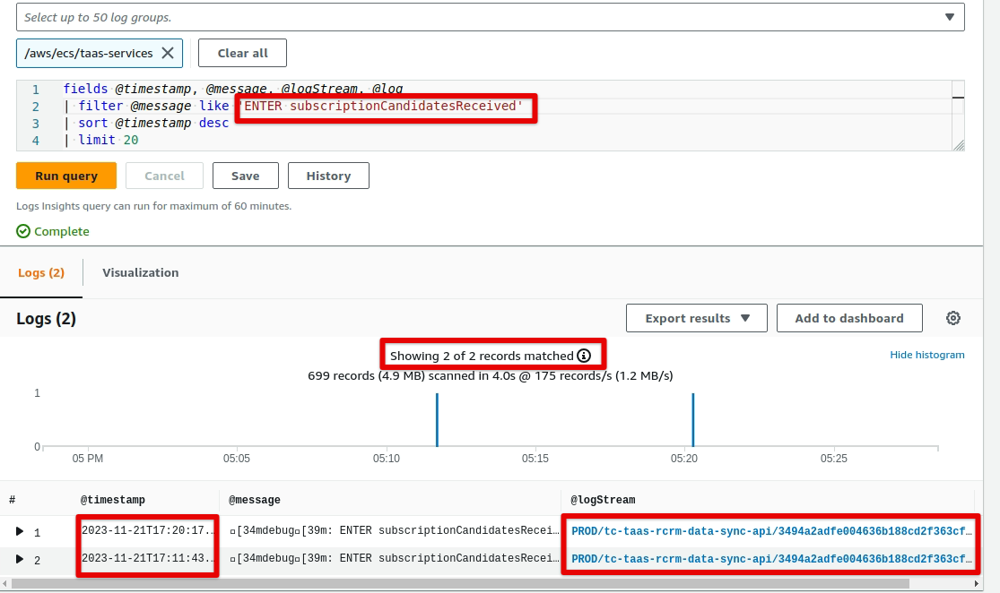

# Objectives:
This document describes the procedure to follow to remove Ubahn-API dependency.
Currently, the user UUIDs in ubahn-api are used to identify the job candidates in TaaS database `job_candidates.userId`

# TaaS-API updates:
The updates performed on taas-apis to remove the dependency on Ubahn-API are the following:

- Update `job_candidates` table to have an additional column `tc_user_id` which will hold the Topcoder legacy user id
- Update `JobCandidate` to have a field `tcUserId` which is mapped to `job_candidates.tc_user_id` column
- Update POST/PATCH/PUT/GET endpoints related to Job candidates to use the new field `tcUserId` instead of Ubahn `userId`

# Service Update procedure:

1. When the updated `taas-apis` code is deployed, run the following command in the taas-apis root folder: `npm run job-candidate:sync`
   This will synchronize the `JobCandidate` model code updates with the database (i.e. add the new `tc_user_id` column)
2. [tc-taas-rcrm-data-sync-api](https://github.com/topcoder-platform/tc-taas-rcrm-data-sync-api) updates needs to be pushed in the same time
   with the taas-apis to minimize losing the updates.
   There may be some data loss in the following scenario:
   - `taas-apis` updates deployment is complete, and `tc-taas-rcrm-data-sync-api` updates deployment is not completed yet
   - A job candidate update occurs in RCRM at this time, `tc-taas-rcrm-data-sync-api` will call `taas-apis` with the
     old payload data using Ubahn-API user UUID, this will generate an error in `tc-taas-rcrm-data-sync-api`
     Manual checks of the `tc-taas-rcrm-data-sync-api`/`taas-apis` are needed right after deployment to fix any data loss in the deployment window.
   - This scenario is unlikely to happen though, there are not too many Job applications, only a few
   - For example, in the last 30 minutes, there are only 2 job applications updates: 
3. Run the script to generate `tcUserId` for existing job candidates using the command specific to each environment
   3.1 - Set the required environment variables: `export UBAHN_DB_URL=<UBAHN-db URL>` - the script also uses the taas-api configuration
   3.2 - For Development environment `NODE_ENV='development' npm run job-candidate:tcUserId:generate`
   3.3 - For Production environment `NODE_ENV='production' npm run job-candidate:tcUserId:generate`
